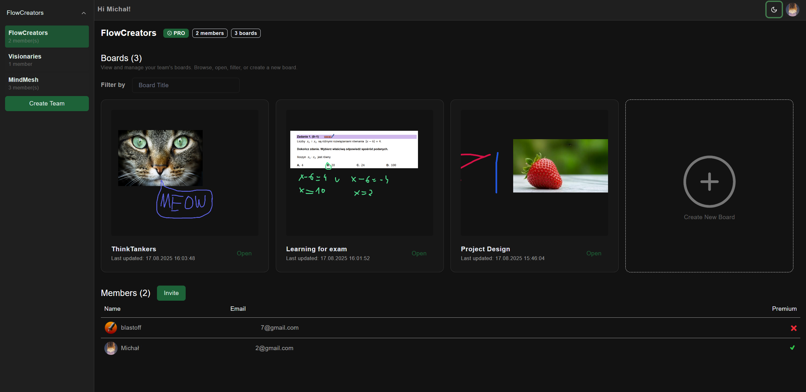

# Boardly

**Boardly** is a collaborative online whiteboard platform. It allows teams to create, manage, and visualize boards, making brainstorming, planning, and project tracking seamless. Users can upgrade their accounts via microtransactions to unlock premium features like unlimited boards per team or unlimited team memberships.

## Table of Contents

* [Features](#features)
* [Architecture](#architecture)
* [Services](#services)
* [Environment Variables](#environment-variables)
* [Getting Started](#getting-started)
* [Screenshots](#screenshots)

---

## Features

* **Team Collaboration**: Create and join teams, and manage access to boards.
* **Boards & Components**: Each board allows adding sticky notes, images, text boxes, and more. Components can be resized, moved, and connected.
* **Premium Upgrades**:

  * Upgrade **Teams** to create unlimited boards.
  * Upgrade **Users** to join unlimited teams.
* **Real-time Updates**: WebSocket-powered live collaboration.
* **File Storage**: Images and files stored via MinIO.
* **Payment Integration**: Stripe for handling microtransactions.

---

## Architecture

Boardly follows a microservices architecture using Docker:

* **Frontend**: Next.js application handling UI, WebSocket connections, and Stripe integration.
* **Backend**: Spring Boot API managing authentication, team/board logic, and payments.
* **WebSocket Server**: Handles real-time communication between clients.
* **Database**: PostgreSQL stores users, teams, boards, and components.
* **MinIO**: Object storage for uploaded images and board attachments.
* **Stripe CLI**: Listens to payment events and forwards them to the backend webhook.

---

## Services (Docker Compose)

```yaml
version: "3.8"
name: boardly
services:
  database: Postgres 15-alpine
  minio: MinIO object storage
  socket: WebSocket server
  stripe-cli: Stripe CLI for webhooks
  backend: Spring Boot API
  frontend: Next.js application
volumes:
  database-data:
  minio-data:
```

---

## Environment Variables

A `.env` file is required with the following variables:

```env
DB_NAME=
DB_USER=
DB_PASSWORD=
DB_PORT=

MINIO_PORT=
MINIO_UI_PORT=
MINIO_ROOT_USER=
MINIO_ROOT_PASSWORD=
MINIO_BUCKET_NAME=

STRIPE_SECRET_KEY=
STRIPE_WEBHOOK_SECRET=
STRIPE_PUBLISHABLE_KEY=

BACKEND_PORT=
FRONTEND_PORT=
WEBSOCKET_PORT=

GOOGLE_CLIENT_ID=
GOOGLE_CLIENT_SECRET=

JWT_ACCESS_SECRET=
JWT_ACCESS_EXPIRATION_MS=
JWT_REFRESH_SECRET=
JWT_REFRESH_EXPIRATION_MS=

FRONTEND_URL=
FRONTEND_SERVER_URL=
MAX_NON_PREMIUM_TEAMS=
MAX_NON_PREMIUM_BOARDS=
```

---

## Getting Started

1. **Clone this repository**

2. **Create `.env` file** and fill in environment variables. You can use .env.example as template.

3. **Run Docker Compose**

```bash
docker compose up
```

4. **Access the application**

* Frontend: `http://localhost:${FRONTEND_PORT}`
* MinIO UI: `http://localhost:${MINIO_UI_PORT}`

5. **Stripe CLI**: Make sure it listens to webhooks and forwards them to the backend.

---

## Screenshots

**Landing Page**


**Dashboard Page**


**Board Page**


**Stripe Payment Page**

